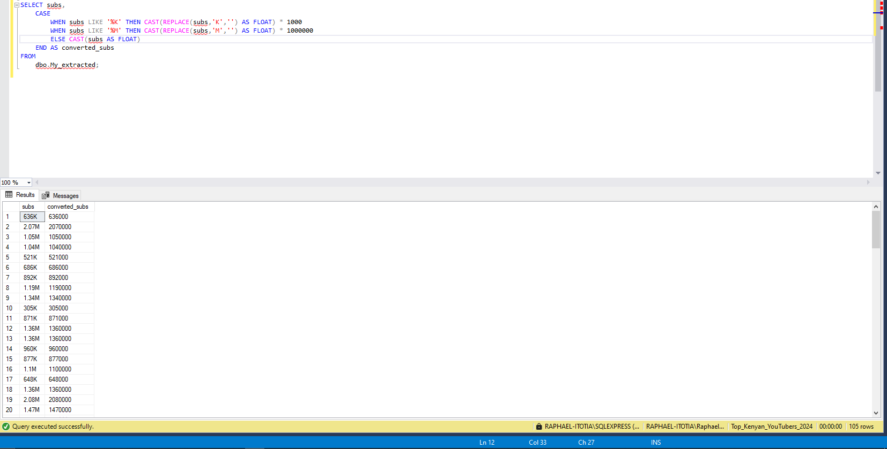
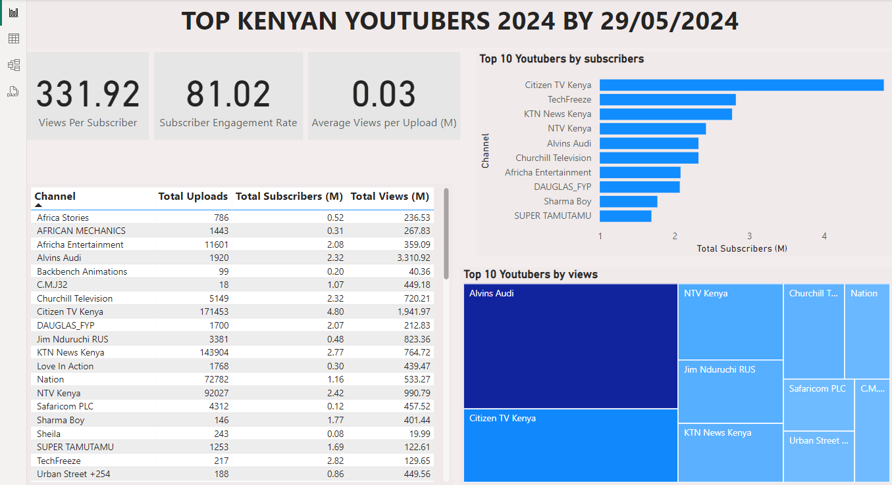
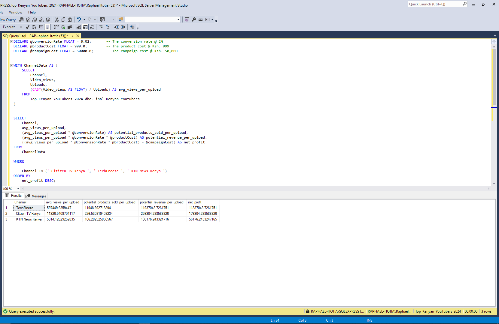
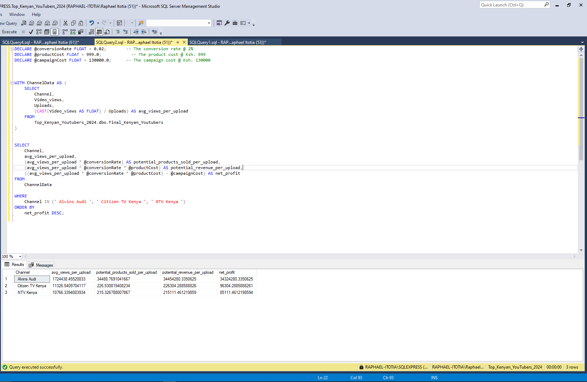
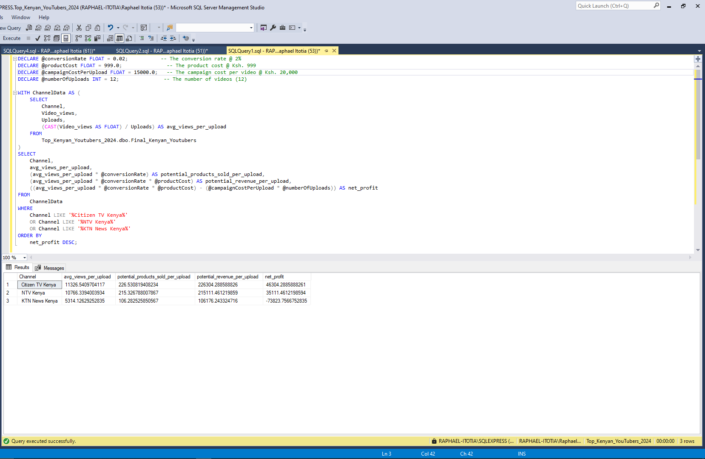

# Unveiling_Top_Kenyan_Youtubers_Analysis_insights
#### Using SQL and Microsoft Power BI

Through this project, I honed my skills in:
  - Data Cleaning & Transformation
- Data Visualization
- Problem-Solving
- Communication ️

## Table of content
-	[Problem statement](#problem-statement)
-	[Steps](#steps)
-	[Design](#design)
    -	[Dashboard Blueprint](#dashboard-blueprint)
    -	[Tools](#tools)
-	[Development](#development)
    -	[Data Exploration](#data-exploration)
    -	[Data Cleaning](#data-cleaning)
    -	[Transform the Data](#transform-the-data)
    -	[Create the SQL View](#create-the-sql-view)
-	[Testing](#testing)
-	[Visualization](#visualization)
    -	[DAX Measures](#dax-measures)
-	[Analysis](#analysis)
    -	[Findings](#findings)
    -	[Validation](#validation)
-	[Recommendations](#recommendations)
-	[Action plan](#action-plan)
### Problem statement
**Challenge**: The Head of Marketing seeks to identify the optimal Kenyan YouTubers for conducting marketing campaigns over the marketing period.

**Data**: To create a dashboard that provides insights, we have a rich dataset of top Kenyan YouTubers in 2024 containing details about Channel name, Number of subscribers, Total views, and Total uploads. 

**Goal**: To uncover the recommendable youtubers to work with by using Power BI.
  
The [data](dataset/My_extracted.csv) is sourced from [Social Blade](https://socialblade.com/youtube/top/country/ke). 
### Steps
-	Design
-	Development
-	Testing
-	Analysis
#### Design
Dashboard components are determined by the following Key areas of analysis:
1.	Who are the top 10 YouTubers with the most subscribers?
2.	Which 3 channels have the most views?
3.	Which 3 channels have the highest average views per upload?
4.	Which 3 channels have the highest views per subscriber ratio?
5.	Which 3 channels have the highest subscriber engagement rate per upload?
6.	Which 3 channels have the most uploads?

##### Dashboard blueprint
Data visuals that may be appropriate include:
1. Table
2. Treemap
3. Scorecards
4. Horizontal bar chart
   


##### Tools

| Tool      | Purpose    |
|---------|---------------------------|
|Excel      |         Exploring the data                        |
|SQL Server |         Cleaning, testing, and analyzing the data |
|Mokkup AI  | Designing the blueprint of the dashboard          |
|Power BI   | Visualizing the data using interactive dashboards |
|GitHub	    | Hosting the project documentation                 |

#### Development
##### Data exploration 
This is the step where you have an inspection of what is in the data, errors, inconsistencies, and bugs.
-	For our dataset,
    -	There are 4 columns that contain the data we need for this analysis.
    
##### Data cleaning
The objective is to enhance our dataset to guarantee its organization and readiness for analysis.

The cleaned dataset should meet the following criteria and constraints:
•	Each column should have data types that are suitable for its contents.
•	No column should contain null values, indicating complete data for all records.(Data quality)

Here is a tabular representation of the expected schema for the cleaned data:

|Column Name	|Data Type	|Nullable|
|-----------|-------|------|
|Channel_name|	VARCHAR|	NO|
|Total_subscribers|	INTEGER|	NO|
|Total_views	|INTEGER|	NO|
|Total_uploads|	INTEGER|	NO|

##### Transform the data
The dataset I used had not indicated the exact number of subscribers. So, I had to convert them as shown below
```sql
SELECT subs,
    CASE 
        WHEN subs LIKE '%K' THEN CAST(REPLACE(subs,'K','') AS FLOAT) * 1000
		WHEN subs LIKE '%M' THEN CAST(REPLACE(subs,'M','') AS FLOAT) * 1000000
		ELSE CAST(subs AS FLOAT)
    END AS converted_subs
FROM 
    dbo.My_extracted;
```


##### Remove Duplicates
```sql
WITH DuplicateCTE AS (
    SELECT
        *,
        ROW_NUMBER() OVER (PARTITION BY Video_views, Uploads, converted_subs ORDER BY Channel) AS row_num
    FROM
       Final_Kenyan_Youtubers
)
DELETE FROM DuplicateCTE
WHERE row_num > 1;

```

##### Testing
###### Data type check
```sql
SELECT
    COLUMN_NAME,
    DATA_TYPE
FROM
    INFORMATION_SCHEMA.COLUMNS
WHERE
    TABLE_NAME = 'Final_Kenyan_Youtubers';
```


###### Duplicate count check
```sql
SELECT Video_views,
           COUNT(*)
FROM Final_Kenyan_Youtubers
GROUP BY Video_views
HAVING COUNT(*) > 1;
```
##### Visualization

###### DAX measures
- Total Views (M)
  
```dax
Total Views (M) = 
VAR billion = 1000000
VAR sumOfTotalViews = SUM(Final_Kenyan_Youtubers[Video_views])
VAR totalViews = ROUND(sumOfTotalViews / billion, 2)

RETURN totalViews
```

- Total subscribers (M)
  
```dax
Total Subscribers (M) = 
VAR million = 1000000
VAR sumOfSubscribers = SUM(Final_Kenyan_Youtubers[converted_subs])
VAR totalSubscribers = DIVIDE(sumOfSubscribers,million)

RETURN totalSubscribers
```

- Total Uploads
  
```dax
Total Uploads = 
VAR totaluploads = SUM(Final_Kenyan_Youtubers[Uploads])

RETURN totaluploads
```

- Average Views Per Upload (M)
  
```dax
Average Views per Upload (M) = 
VAR sumOfTotalViews = SUM(Final_Kenyan_Youtubers[Video_views])
VAR sumOfTotalUploads = SUM(Final_Kenyan_Youtubers[Uploads])
VAR  avgViewsPerUpload = DIVIDE(sumOfTotalViews,sumOfTotalUploads, BLANK())
VAR finalAvgViewsPerUpload = DIVIDE(avgViewsPerUpload, 1000000, BLANK())

RETURN finalAvgViewsPerUpload
```

- Subscriber Engagement Rate
  
```dax
Subscriber Engagement Rate = 
VAR sumOfTotalSubscribers = SUM(Final_Kenyan_Youtubers[converted_subs])
VAR sumOfTotalUploads = SUM(Final_Kenyan_Youtubers[Uploads])
VAR subscriberEngRate = DIVIDE(sumOfTotalSubscribers, sumOfTotalUploads, BLANK())

RETURN subscriberEngRate 
```

- Views per subscriber
  
```dax
Views Per Subscriber = 
VAR sumOfTotalViews = SUM(Final_Kenyan_Youtubers[Video_views])
VAR sumOfTotalSubscribers = SUM(Final_Kenyan_Youtubers[converted_subs])
VAR viewsPerSubscriber = DIVIDE(sumOfTotalViews, sumOfTotalSubscribers, BLANK())

RETURN viewsPerSubscriber 
```

##### Analysis
###### Findings
1. Who are the top 10 YouTubers with the most subscribers?

    |Rank|Channel|Total subscribers (M)|
    |-----|------|----------|
    |1|Citizen TV Kenya|4.80|
    |2|TechFreeze| 2.82|
    |3| KTN News Kenya|2.77|
    |4| NTV Kenya| 2.42|
    |5| Churchill Television|2.32|
    |6| Alvins Audi |2.32|
    |7| Africha Entertainment |2.08|
    |8|DAUGLAS_FYP |2.07|
    |9| Sharma Boy|1.77|
    |10|  SUPER TAMUTAMU|1.69|

2. Which 3 channels have the most views?

   |Rank|Channel|Total views (M)|
   |-----|------|----------|
   |1|Alvins Audi|3310.92|
   |2|Citizen TV Kenya| 1941.97|
   |3| NTV Kenya|990.79|

3. Which 3 channels have the highest average views per upload?

   |Rank|Channel|avg views per upload (M)|
   |-----|------|----------|
   |1|Sharma Boy|2.75|
   |2|Alvins Audi| 1.72|
   |3|TechFreeze|0.60|
  
4. Which 3 channels have the highest views per subscriber ratio?

   |Rank|Channel|views per subscriber|
   |-----|------|----------|
   |1|Alvins Audi|1427.12|
   |2| NTV Kenya|409.42|
   |3|Citizen TV Kenya| 404.58|
   
5. Which 3 channels have the highest subscriber engagement rate per upload?

   |Rank|Channel|sub eng rate per upload|
   |-----|------|----------| 
   |1|TechFreeze|12995.39|
    |2|Sharma Boy|12123.29|
    |3|  SUPER TAMUTAMU|1348.76|
    
6. Which 3 channels have the most uploads?

   |Rank|Channel|uploads|
   |-----|------|----------|
    |1|Citizen TV Kenya| 171453|
    |2| KTN News Kenya|143904|
    |3| NTV Kenya|92027|
   
For this analysis, we'll focus on evaluating the metrics crucial for achieving the expected ROI for our marketing client. Specifically, we'll prioritize analyzing YouTube channels based on the following key metrics:

- Number of subscribers
- Total views
- Number of uploads

###### Validation
1. Youtubers with the most subscribers
   
Campaign idea = product placement

SQL Query
```sql
   DECLARE @conversionRate FLOAT = 0.02;		-- The conversion rate @ 2%
DECLARE @productCost FLOAT = 999.0;			-- The product cost @ Ksh. 999
DECLARE @campaignCost FLOAT = 50000.0;		-- The campaign cost @ Ksh. 50,000	
   

WITH ChannelData AS (
    SELECT 
        Channel,
        Video_views,
        Uploads,
        (CAST(Video_views AS FLOAT) / Uploads) AS avg_views_per_upload
    FROM 
        Top_Kenyan_YouTubers_2024.dbo.Final_Kenyan_Youtubers
)
    

SELECT 
    Channel,
    avg_views_per_upload,
    (avg_views_per_upload * @conversionRate) AS potential_products_sold_per_upload,
    (avg_views_per_upload * @conversionRate * @productCost) AS potential_revenue_per_upload,
    ((avg_views_per_upload * @conversionRate * @productCost) - @campaignCost) AS net_profit
FROM 
    ChannelData

WHERE

    Channel IN (' Citizen TV Kenya ', ' TechFreeze ', ' KTN News Kenya ')
ORDER BY
    net_profit DESC;
```

Best option from this category: TechFreeze

2. Youtubers with the most views

Campaign idea = Influencer marketing

SQL Query
```sql
DECLARE @conversionRate FLOAT = 0.02;        -- The conversion rate @ 2%
DECLARE @productCost FLOAT = 999.0;            -- The product cost @ Ksh. 999
DECLARE @campaignCost FLOAT = 130000.0;      -- The campaign cost @ Ksh. 130,000


WITH ChannelData AS (
    SELECT
        Channel,
        Video_views,
        Uploads,
        (CAST(Video_views AS FLOAT) / Uploads) AS avg_views_per_upload
    FROM
        Top_Kenyan_Youtubers_2024.dbo.Final_Kenyan_Youtubers
)


SELECT
    Channel,
    avg_views_per_upload,
    (avg_views_per_upload * @conversionRate) AS potential_products_sold_per_upload,
    (avg_views_per_upload * @conversionRate * @productCost) AS potential_revenue_per_upload,
    ((avg_views_per_upload * @conversionRate * @productCost) - @campaignCost) AS net_profit
FROM
    ChannelData
	
WHERE
    Channel IN (' Alvins Audi ', ' Citizen TV Kenya ', ' NTV Kenya ')
ORDER BY
    net_profit DESC;
```

Best option from this category: Alvins Audi 

3. Which 3 channels have the most uploads?
   
Campaign idea = sponsored video series

SQL Query
```sql
DECLARE @conversionRate FLOAT = 0.02;           -- The conversion rate @ 2%
DECLARE @productCost FLOAT = 999.0;               -- The product cost @ Ksh. 999
DECLARE @campaignCostPerUpload FLOAT = 15000.0;   -- The campaign cost per video @ Ksh. 15,000
DECLARE @numberOfUploads INT = 12;               -- The number of videos (12)

WITH ChannelData AS (
    SELECT
        Channel,
        Video_views,
        Uploads,
        (CAST(Video_views AS FLOAT) / Uploads) AS avg_views_per_upload
    FROM
        Top_Kenyan_Youtubers_2024.dbo.Final_Kenyan_Youtubers
)
SELECT
    Channel,
    avg_views_per_upload,
    (avg_views_per_upload * @conversionRate) AS potential_products_sold_per_upload,
    (avg_views_per_upload * @conversionRate * @productCost) AS potential_revenue_per_upload,
    ((avg_views_per_upload * @conversionRate * @productCost) - (@campaignCostPerUpload * @numberOfUploads)) AS net_profit
FROM
    ChannelData
WHERE
    Channel LIKE '%Citizen TV Kenya%'
    OR Channel LIKE '%NTV Kenya%'
    OR Channel LIKE '%KTN News Kenya%'
ORDER BY
    net_profit DESC;
```

Best option from this category: Citizen TV Kenya 

##### Recommendations

- TechFreeze is the best YouTube channel if we want to maximize Return On Investment based on subscribers. A product placement campaign would give a net profit of Ksh.11,887,043 
- Alvins Audi is the best YouTuber if we are interested in maximizing Return On Investment based on number of views. An influencer marketing contract would give a net profit of Ksh.34,454,280
- Citizen TV Kenya is the best Youtube channel if we are maximizing ROI based on who uploads frequently. Sponsoring several uploads would give a net profit of Ksh.46,304
- Although not much, KTN News Kenya would also bring a net profit of Ksh.56,176 on product placement and NTV Kenya a net profit of Ksh.215,111 on influencer marketing.

 ##### Action plan

Based on this analysis, we beieve the best channel to advance a long-term partnership deal with to promote the client’s products is the Alvins Audi channel.

1. Reach out to the teams behind each of these channels, starting with Alvins Audi.
2. Negotiate deals within the budgets allocated to each marketing campaign
3. Kick off the campaigns and track each of their performances against the KPIs.
4. Review how the campaigns have gone, gather insights and optimize based on feedback from converted customers and each channel’s audiences.


