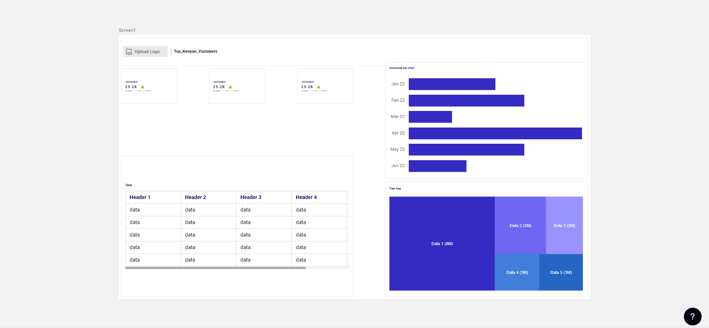
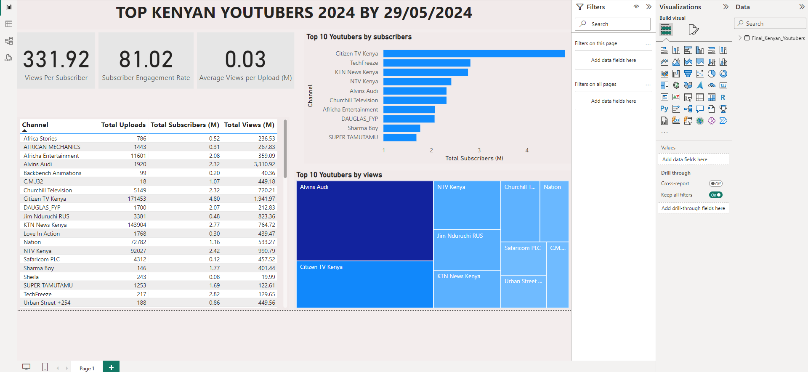

# Unveiling_Top_Kenyan_Youtubers_Analysis_insights
#### Using SQL and Microsoft Power BI

## Table of content
-	[Problem statement](#problem-statement)
-	[Steps](#steps)
-	[Design](#design)
    -	[Dashboard Blueprint](#dashboard-blueprint)
    -	[Tools](#tools)
-	[Development](#development)
    -	[Data Exploration](#data-exploration)
    -	[Data Cleaning](#data-cleaning)
    -	[Transform the Data](#transform-the-data)
    -	[Create the SQL View](#create-the-sql-view)
-	[Testing](#testing)
-	[Visualization](#visualization)
    -	[DAX Measures](#dax-measures)
-	[Analysis](#analysis)
    -	[Findings](#findings)
    -	[Validation](#validation)
    -	[Discovery](#discovery)
-	[Recommendations](#recommendations)
    -	[Potential ROI](#potential-roi)
    -	[Potential Courses of Actions](#potential-courses-of-actions)
-	[Conclusion](#conclusion)
### Problem statement
**Challenge**: The Head of Marketing seeks to identify the optimal Kenyan YouTubers for conducting marketing campaigns over the marketing period.

**Data**: To create a dashboard that provides insights, we have a rich dataset of top Kenyan YouTubers in 2024 containing details about Channel name, Number of subscribers, Total views, and Total uploads. 

**Goal**: To uncover the recommendable youtubers to work with by using Power BI.
  
The [data](dataset/My_extracted.csv) is sourced from [Social Blade](https://socialblade.com/youtube/top/country/ke). 
### Steps
-	Design
-	Development
-	Testing
-	Analysis
#### Design
Dashboard components are determined by the following Key areas of analysis:
1.	Who are the top 10 YouTubers with the most subscribers?
2.	Which 3 channels have the most views?
3.	Which 3 channels have the highest average views per video?
4.	Which 3 channels have the highest views per subscriber ratio?
5.	Which 3 channels have the highest subscriber engagement rate per video uploaded?
6.	Which 3 channels have the most uploads?

##### Dashboard blueprint
Data visuals that may be appropriate include:
1. Table
2. Treemap
3. Scorecards
4. Horizontal bar chart
   


##### Tools

| Tool      | Purpose    |
|---------|---------------------------|
|Excel      |         Exploring the data                        |
|SQL Server |         Cleaning, testing, and analyzing the data |
|Mokkup AI  | Designing the blueprint of the dashboard          |
|Power BI   | Visualizing the data using interactive dashboards |
|GitHub	    | Hosting the project documentation                 |

#### Development
##### Data exploration 
This is the step where you have an inspection of what is in the data, errors, inconsistencies, and bugs.
-	For our dataset,
    -	There are 4 columns that contain the data we need for this analysis.
    
##### Data cleaning
The objective is to enhance our dataset to guarantee its organization and readiness for analysis.

The cleaned dataset should meet the following criteria and constraints:
•	Each column should have data types that are suitable for its contents.
•	No column should contain null values, indicating complete data for all records.(Data quality)

Here is a tabular representation of the expected schema for the cleaned data:

|Column Name	|Data Type	|Nullable|
|-----------|-------|------|
|Channel_name|	VARCHAR|	NO|
|Total_subscribers|	INTEGER|	NO|
|Total_views	|INTEGER|	NO|
|Total_uploads|	INTEGER|	NO|

##### Transform the data
The dataset I used had not indicated the exact number of subscribers. So, I had to convert them as shown below
```sql
SELECT subs,
    CASE 
        WHEN subs LIKE '%K' THEN CAST(REPLACE(subs,'K','') AS FLOAT) * 1000
		WHEN subs LIKE '%M' THEN CAST(REPLACE(subs,'M','') AS FLOAT) * 1000000
		ELSE CAST(subs AS FLOAT)
    END AS converted_subs
FROM 
    dbo.My_extracted;
```

##### Create the SQL view
```sql
CREATE view Kenyan_Youtubers AS 
SELECT 
	Channel,
	uploads AS Uploads,
	CASE 
        WHEN subs LIKE '%K' THEN CAST(REPLACE(subs,'K','') AS FLOAT) * 1000
		WHEN subs LIKE '%M' THEN CAST(REPLACE(subs,'M','') AS FLOAT) * 1000000
		ELSE CAST(subs AS FLOAT)
    END AS converted_subs,
	video_views AS Video_views
FROM dbo.My_extracted
```

##### Remove Duplicates
```sql
SELECT DISTINCT *
INTO Final_Kenyan_Youtubers
FROM dbo.Kenyan_Youtubers
```

##### Testing
###### Data type check
```sql
SELECT
    COLUMN_NAME,
    DATA_TYPE
FROM
    INFORMATION_SCHEMA.COLUMNS
WHERE
    TABLE_NAME = 'Final_Kenyan_Youtubers';
```


###### Duplicate count check
```sql
SELECT
    Channel,
    COUNT(*) AS duplicate_count
FROM
    Final_Kenyan_Youtubers


GROUP BY
    Channel


HAVING
    COUNT(*) > 1;
```
##### Visualization

###### DAX measures
- Total Views (M)
  
```dax
Total Views (M) = 
VAR billion = 1000000
VAR sumOfTotalViews = SUM(Final_Kenyan_Youtubers[Video_views])
VAR totalViews = ROUND(sumOfTotalViews / billion, 2)

RETURN totalViews
```

- Total subscribers (M)
  
```dax
Total Subscribers (M) = 
VAR million = 1000000
VAR sumOfSubscribers = SUM(Final_Kenyan_Youtubers[converted_subs])
VAR totalSubscribers = DIVIDE(sumOfSubscribers,million)

RETURN totalSubscribers
```

- Total Uploads
  
```dax
Total Uploads = 
VAR totaluploads = SUM(Final_Kenyan_Youtubers[Uploads])

RETURN totaluploads
```

- Average Views Per Upload (M)
  
```dax
Average Views per Upload (M) = 
VAR sumOfTotalViews = SUM(Final_Kenyan_Youtubers[Video_views])
VAR sumOfTotalUploads = SUM(Final_Kenyan_Youtubers[Uploads])
VAR  avgViewsPerUpload = DIVIDE(sumOfTotalViews,sumOfTotalUploads, BLANK())
VAR finalAvgViewsPerUpload = DIVIDE(avgViewsPerUpload, 1000000, BLANK())

RETURN finalAvgViewsPerUpload
```

- Subscriber Engagement Rate
  
```dax
Subscriber Engagement Rate = 
VAR sumOfTotalSubscribers = SUM(Final_Kenyan_Youtubers[converted_subs])
VAR sumOfTotalUploads = SUM(Final_Kenyan_Youtubers[Uploads])
VAR subscriberEngRate = DIVIDE(sumOfTotalSubscribers, sumOfTotalUploads, BLANK())

RETURN subscriberEngRate 
```

- Views per subscriber
  
```dax
Views Per Subscriber = 
VAR sumOfTotalViews = SUM(Final_Kenyan_Youtubers[Video_views])
VAR sumOfTotalSubscribers = SUM(Final_Kenyan_Youtubers[converted_subs])
VAR viewsPerSubscriber = DIVIDE(sumOfTotalViews, sumOfTotalSubscribers, BLANK())

RETURN viewsPerSubscriber 
```

##### Analysis
###### Findings
1. Who are the top 10 YouTubers with the most subscribers?

    |Rank|Channel|Total subscribers (M)|
    |-----|------|----------|
    |1|Citizen TV Kenya|4.80|
    |2|TechFreeze| 2.82|
    |3| KTN News Kenya|2.77|
    |4| NTV Kenya| 2.42|
    |5| Churchill Television|2.32|
    |6| Alvins Audi |2.32|
    |7| Africha Entertainment |2.08|
    |8|DAUGLAS_FYP |2.07|
    |9| Sharma Boy|1.77|
    |10|  SUPER TAMUTAMU|1.69|

2. Which 3 channels have the most views?

   |Rank|Channel|Total views (M)|
   |-----|------|----------|
   |1|Alvins Audi|3310.92|
   |2|Citizen TV Kenya| 1941.97|
   |3| NTV Kenya|990.79|

3. Which 3 channels have the highest average views per upload?

   |Rank|Channel|avg views per upload (M)|
   |-----|------|----------|
   |1|Sharma Boy|2.75|
   |2|Alvins Audi| 1.72|
   |3|TechFreeze|0.60|
  
4. Which 3 channels have the highest views per subscriber ratio?

   |Rank|Channel|views per subscriber|
   |-----|------|----------|
   |1|Alvins Audi|1427.12|
   |2| NTV Kenya|409.42|
   |3|Citizen TV Kenya| 404.58|
   
5. Which 3 channels have the highest subscriber engagement rate per upload?

   |Rank|Channel|sub eng rate per upload|
   |-----|------|----------| 
   |1|TechFreeze|12995.39|
    |2|Sharma Boy|12123.29|
    |3|  SUPER TAMUTAMU|1348.76|
    
6. Which 3 channels have the most uploads?

   |Rank|Channel|uploads|
   |-----|------|----------|
    |1|Citizen TV Kenya| 171453|
    |2| KTN News Kenya|143904|
    |3| NTV Kenya|92027|
   
